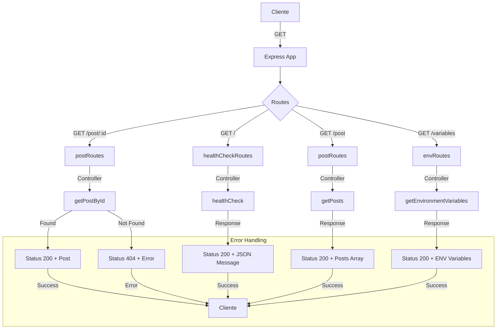

```mermaid
graph TD
    A[Cliente] -->|GET| B[Express App]
    B --> C{Routes}

    C -->|GET /| D[healthCheckRoutes]
    D -->|Controller| E[healthCheck]
    E -->|Response| K[Status 200 + JSON Message]

    C -->|GET /post| F[postRoutes]
    F -->|Controller| G[getPosts]
    G -->|Response| L[Status 200 + Posts Array]

    C -->|GET /post/:id| H[postRoutes]
    H -->|Controller| I[getPostById]
    I -->|Found| M[Status 200 + Post]
    I -->|Not Found| N[Status 404 + Error]

    C -->|GET /variables| J[envRoutes]
    J -->|Controller| O[getEnvironmentVariables]
    O -->|Response| P[Status 200 + ENV Variables]

    subgraph Error Handling
        M -->|Success| Q[Cliente]
        N -->|Error| Q[Cliente]
        K -->|Success| Q[Cliente]
        L -->|Success| Q[Cliente]
        P -->|Success| Q[Cliente]
    end
```
